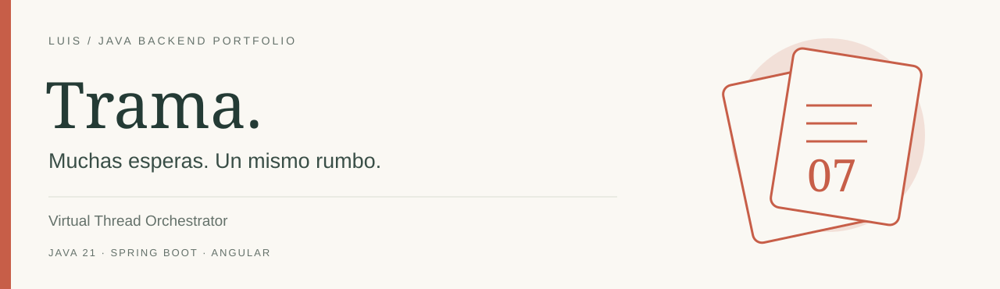
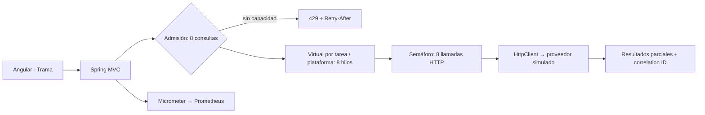

# Virtual Thread Orchestrator

**Consultar varios proveedores sin reservar un hilo del sistema operativo para cada espera.** Trama permite observar fan-out, deadlines y capacidad limitada con Java 21 y Angular.

[](https://github.com/LuisDeveloper-Fer/virtual-thread-orchestrator/actions)

## Arquitectura



Java 21 · Spring Boot 4.1.1 · Maven · HttpClient · Angular 21 · Docker Compose. Sin APIs preview.

## Ejecutar

```bash
mvn clean package
docker compose up --build
```

Interfaz: http://localhost:4206 · API: http://localhost:8086 · Prometheus: http://localhost:9097.

Sin Docker: inicia `node simulator/server.mjs` y `java -jar target/virtual-thread-orchestrator-1.0.0.jar` (API 8080). En frontend ejecuta `npm ci` y `npm start`. Requisitos: JDK 21, Maven 3.9+, Node 22.12+.

## Probar

```bash
curl -i http://localhost:8086/api/quotes -H 'Content-Type: application/json' -d '{"mode":"VIRTUAL","scenario":"SUCCESS","providers":6}'
```

Cambia mode a PLATFORM y scenario a ERROR, SLOW o NEVER. La duración es una medición de esa consulta, no un benchmark ni una promesa de aceleración.

## Recorrido técnico

- [Decisión de arquitectura](docs/adr/001-design.md): admisión, semáforo, cancelación y límites.
- [Contrato HTTP](docs/api.md) y [guía para entrevista](docs/interview.md).
- `src/main/java/dev/portfolio/api`: validación; `orchestration`: coordinación e I/O.
- `src/test`: HTTP real, ejecutores, saturación y deadline.
- `simulator`: fallos reproducibles; `frontend`: experiencia interactiva.

Métricas: `quotes_batch_duration_seconds`, `quotes_results_total`, `quotes_rejected_total` y `quotes_active_calls`. Sin IDs en etiquetas.

Datos ficticios. MIT. [LuisDeveloper-Fer](https://github.com/LuisDeveloper-Fer).
